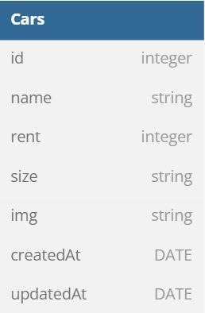
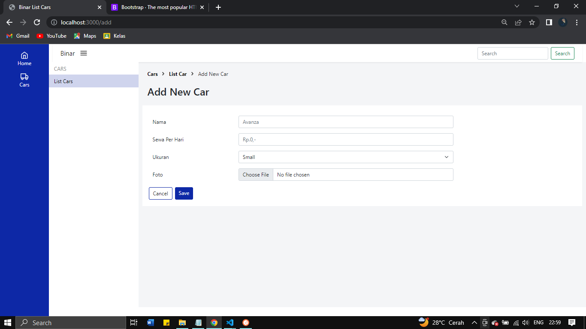
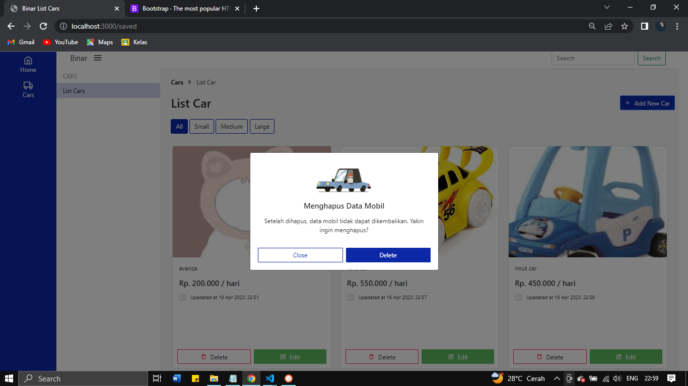

# FSW - 3 - Challenge Chapter 4 

## Entity Relationship Diagram

## Menjalankan Server

Langkah pertama kita untuk menjalankan server, dapat menggunakan `npm run start`. Namun, jika ingin menjalankan secara langsung dapat menggunakan nodemon dengan perintah 
Untuk memulai aplikasi ini lakukan perintah `npm run dev` perintah ini dapat dilakukan pada terminal. 

## Tampilan Ketika Berhasil Dijalankan
Berikut adalah tampilan web yang telah dibuat pada challenge ini 
 - Home

  - Add New Car

 - Update Car

- Delete & Alert

